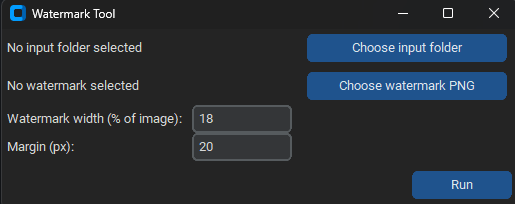

# Watermark Tool

A simple Python GUI tool for batch-applying a watermark to images.

## Features

- Choose an input folder containing your images
- Choose a watermark PNG (with transparent background)
- Automatically resizes the watermark proportionally to each image's width
- Places the watermark in the bottom-right corner with a configurable margin
- Adjustable watermark size (as a % of image width)
- Supports both PNG and JPG/JPEG images in the same batch
- Saves results to a new `watermarked` subfolder, leaving originals untouched

## Download

Download the latest `.exe` from the [Releases page]([#](https://github.com/luboskollar/watermarker/releases/tag/v1.0)) - no Python installation required.

## Usage

1. Click **Choose input folder** and select the folder with your images
2. Click **Choose watermark PNG** and select your watermark file
3. Adjust **Watermark width (% of image)** and **Margin (px)** if needed (I recommend 60% width and 0 margin)
4. Click **Run**
5. Find your watermarked images in the `watermarked` subfolder

## Screenshot

## Built with

- Python
- customtkinter (GUI)
- Pillow (image processing)
